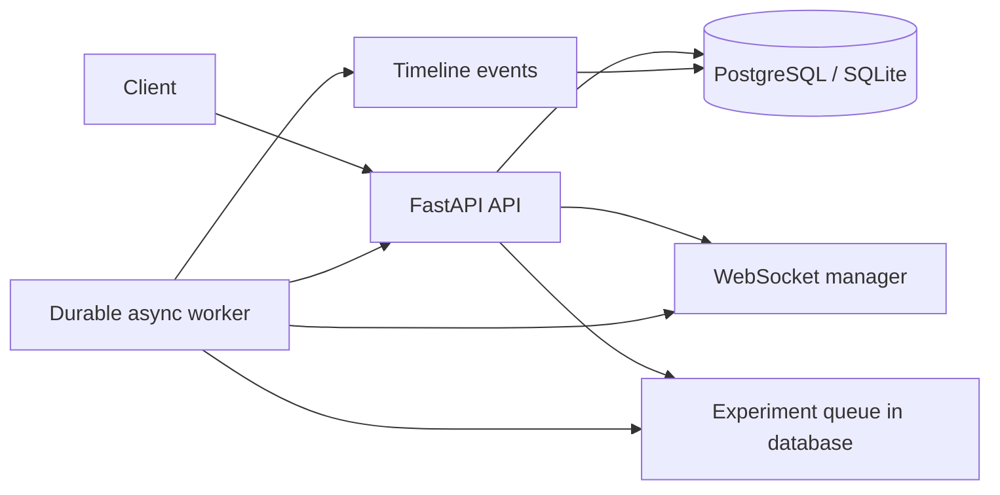

# RevokeLab

RevokeLab is a running-system authorization testing service that detects access which survives after a user’s permission is removed.

It opens an authenticated live connection, revokes the user, creates new private data after a declared cutoff, and records whether that data still reaches the removed user.

- Repository: https://github.com/quratulain-nayeem/RevokeLab
- Live API: Added after deployment
- Interactive API documentation: `/docs`
- Health check: `/health`

## The problem

Removing a user from a permissions table does not guarantee that every access path stops immediately. Existing WebSocket connections, cached permissions, delayed invalidation, or queued work can continue exposing private data.

RevokeLab produces a short, reproducible timeline showing exactly what happened after access was revoked.

## Demonstrated result

RevokeLab provides two WebSocket authorization modes:

- `connection-only`: permission is checked only when the connection opens. This intentionally demonstrates a delayed-revocation failure.
- `continuous`: permission is checked before each private message is delivered. Revoked users receive an `access_revoked` event instead of private data.

A failed security policy and a failed worker are different:

- `status: succeeded, result: fail` means the experiment completed and found an authorization failure.
- `status: failed` means the experiment itself could not complete.

## Architecture



The HTTP request only validates and queues an experiment, returning `202 Accepted` immediately. The durable worker performs the slower revocation test afterward.

## Data model

### `users`

Stores accounts, password hashes, account status, and the `member` or `admin` role.

Relationships:

- A user can create projects.
- A user can have project memberships.
- A user can send messages.
- A user can own experiment runs.

### `projects`

Represents a private workspace containing members and messages.

Relationships:

- Created by one user.
- Has many memberships, messages, and experiments.

### `memberships`

Connects users to projects and records whether access is `active` or `revoked`.

Constraints:

- `(user_id, project_id)` is unique, preventing duplicate memberships.
- Status is restricted to `active` or `revoked`.
- Foreign keys prevent memberships from referencing nonexistent users or projects.

### `messages`

Stores private project messages.

Constraints:

- `message_code` is unique, making message creation safe to retry.
- Foreign keys require valid projects and senders.

### `experiment_runs`

Stores queued and completed authorization experiments.

Important fields include authorization mode, cutoff, status, attempt count, result, and structured failure information.

Constraints:

- `(owner_id, idempotency_key)` is unique, preventing duplicate jobs.
- Authorization mode is restricted to supported modes.
- Status is restricted to the worker lifecycle states.
- The cutoff must be between 1 and 60 seconds.

### `experiment_events`

Stores the ordered evidence timeline for each experiment.

Constraints:

- `(experiment_id, sequence)` is unique, ensuring an unambiguous event order.
- Each event must reference an existing experiment.

## Authentication and authorization

Passwords are hashed using Argon2 and never stored as plaintext.

Session cookies protect authenticated routes:

- Missing or invalid authentication returns `401`.
- A user without active project access receives `403`.
- Experiments are visible only to their owner or an administrator.
- Unauthorized experiment lookups return `404` to avoid revealing whether another user’s record exists.
- Only administrators can grant or revoke memberships.

## Retry-safe writes

### Message creation

Clients provide a unique `message_code`. Repeating the same request returns the original message instead of creating a duplicate.

### Experiment creation

Clients provide an `Idempotency-Key` header.

- Repeating the same key and payload returns the original experiment.
- Reusing the key with a changed payload returns `409 Conflict`.
- The database unique constraint prevents concurrent duplicate creation.

## Worker lifecycle and crash recovery

Experiment states are:

```text
queued -> running -> succeeded
                  -> queued for retry
                  -> failed after maximum attempts
```

Before execution, the worker commits `status=running` and increments the attempt counter.

If the worker dies halfway through:

1. The experiment remains durably stored as `running`.
2. A replacement worker searches for both `queued` and interrupted `running` jobs.
3. It adds a `worker_recovered` timeline event.
4. It retries the experiment.
5. After three unsuccessful attempts, the job becomes `failed` with an actionable error code.

Completed jobs are not claimed again. Repeating the original HTTP request returns the same experiment because of its idempotency key.

## API endpoints

| Method | Endpoint | Purpose |
|---|---|---|
| `POST` | `/auth/login` | Create an authenticated session |
| `POST` | `/auth/logout` | End the session |
| `GET` | `/auth/me` | Read the current account |
| `GET` | `/projects/{id}` | Read an authorized project |
| `POST` | `/projects/{id}/messages` | Create a retry-safe message |
| `POST` | `/projects/{id}/members/{user_id}/revoke` | Revoke membership |
| `POST` | `/projects/{id}/members/{user_id}/grant` | Restore membership |
| `POST` | `/experiments` | Queue an experiment |
| `GET` | `/experiments/{id}` | Read result and timeline |
| WebSocket | `/ws/connection-only/projects/{id}` | Demonstrate stale connection access |
| WebSocket | `/ws/continuous/projects/{id}` | Enforce continuous authorization |
| `GET` | `/health` | Deployment health check |

## Local setup

Requires Python 3.12.

```powershell
git clone https://github.com/quratulain-nayeem/RevokeLab.git
cd RevokeLab
py -3.12 -m venv .venv
.\.venv\Scripts\Activate.ps1
python -m pip install -r requirements.txt
```

Copy `.env.example` to `.env`, replace the placeholder values, and never commit `.env`.

Seed the database:

```powershell
python seed.py
```

Start the API:

```powershell
uvicorn app.main:app --reload
```

Open http://127.0.0.1:8000/docs.

For manual worker execution:

```powershell
python worker.py --once
```

For an always-running local worker, omit `--once`.

## Tests

Run:

```powershell
pytest -v
```

The automated suite verifies:

- Password hashing and incorrect-login handling.
- Authentication requirements.
- Project isolation.
- Retry-safe message creation.
- Idempotent revoke and grant operations.
- The connection-only revocation failure.
- Continuous authorization blocking.
- Retry-safe experiment creation.
- Idempotency-key conflicts.
- Unauthenticated experiment rejection.

## Deployment

`render.yaml` defines:

- A public FastAPI web service.
- A PostgreSQL database.
- Secure generated session secrets.
- Non-committed account passwords.
- HTTPS-only session cookies.
- The integrated durable worker.
- A `/health` deployment check.

Deploy it as a Render Blueprint and provide the three requested test-account passwords. No secret is committed to the repository.

## Current limitations

This portfolio version intentionally uses one worker process. Multiple workers would require transactional row claiming, such as PostgreSQL `FOR UPDATE SKIP LOCKED`.

The current integration targets HTTP and WebSocket access paths. Future versions could add permission-cache invalidation, background task credentials, multi-instance testing, and controlled network fault injection.